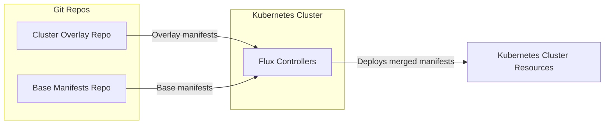

# Service Onboarding Workflow for openCenter Clusters

This guide provides a **step-by-step process** for onboarding services into **openCenter clusters** using **Flux overlays**.  
The goal is to ensure every service is deployed in a **secure**, **consistent**, and **fully GitOps-managed** way.

Overlays let you layer **environment-specific configurations** on top of shared manifests from the [base repository](https://github.com/rackerlabs/openCenter-gitops-base).

---

## How It Works

The following diagram shows how the **overlay repository**, **base repository**, and **Flux** work together to deploy services into your Kubernetes cluster.



- **Base Manifests Repo** – Holds reusable and shared manifests common across clusters.  
- **Cluster Overlay Repo** – Contains environment-specific configurations and overlays.  
- **Flux** – Watches both repos and automatically applies manifests to your Kubernetes cluster.

This model ensures **consistent deployments**, **version control**, and **easy traceability** of all changes.

---

## Toolchain Overview

Ensure you're familiar with the following tools used in this workflow:

| Tool | Purpose |
|------|----------|
| **kubectl** | Used to interact with the cluster (apply, inspect, debug). |
| **kustomize** | Used to render overlays; it's built into kubectl. |
| **Flux CLI** | Bootstraps Flux, defines Git sources, and manages reconciliations. |
| **sops** | Encrypts YAML/JSON secrets while preserving structure. |
| **age** | Lightweight encryption tool used by SOPS as a backend. |
| **helm** | Used for Helm chart management. |

---

## Prerequisites

Before beginning, make sure you have the following:

1. Access to:
   - Your **cluster overlay Git repository**  
   - The [openCenter base Git repository](https://github.com/rackerlabs/openCenter-gitops-base)
2. Local clones of:
   - The **cluster overlay repository**
   - [`rpc-environments/000000-opencenter-example`](https://github.com/rpc-environments/000000-opencenter-example) for reference.
3. Installed binaries: `kubectl`, `sops`, `helm`, and `age`. See the [Additional References](#additional-references) section for installation links.

4. An **SSH key pair** registered with GitHub and available on your workstation.

   If you don’t already have one, create a new key:

   ```bash
   GIT_REPO="your-org/your-repo"
   CLUSTER_NAME="your-cluster"
   ssh-keygen -t ed25519 -C "git@github.com:${GIT_REPO}.git" -f "$HOME/.ssh/${CLUSTER_NAME}_id_ed25519"
   ```

   Then add the public key (`~/.ssh/${CLUSTER_NAME}_id_ed25519.pub`) to your GitHub repo under  
   **Settings → Deploy Keys**, granting **write** access.  
   This allows your Flux instance to push updates to the overlay repo.

### Execution Environment

All the following steps can be executed from **any server or workstation** that has:

- **kubectl** access to the target cluster (with proper kubeconfig context)
- The required binaries installed (`kubectl`, `sops`, `helm`, and `age`)

You do **not** need to run these commands from within the cluster itself.

---

## Step 1: Bootstrap Flux on a Newly Deployed Cluster

Flux must manage the cluster state before any overlays can reconcile.

Run the following commands:

```bash
GIT_REPO="your-org/your-repo"
CLUSTER_NAME="your-cluster"
curl -s https://fluxcd.io/install.sh | sudo FLUX_VERSION=2.7.0 bash
flux bootstrap git   --url=ssh://git@github.com/${GIT_REPO}.git   --branch=main   --private-key-file=${HOME}/.ssh/${CLUSTER_NAME}_id_ed25519   --path=applications/overlays/${CLUSTER_NAME}
flux get all -A
```

**What this does:**

- Installs Flux components in your cluster.
- Creates the `flux-system` namespace.
- Commits bootstrap manifests back to your Git repo.
- The `flux get all -A` command confirms controllers are healthy and can sync with Git.

If any resources appear **degraded**, resolve those issues before proceeding.

Next:

```bash
git pull
```

Pulls the latest bootstrap commits from the remote repo.

- Then create a feature branch for your onboarding work:

```bash
git checkout -b onboard-services_${CLUSTER_NAME}
```

---

## Step 2: Prepare the Overlay Skeleton

You'll now set up the folder structure for your cluster's overlay.

1. Use [`rpc-environments/000000-opencenter-example`](https://github.com/rpc-environments/000000-opencenter-example) as your **template layout**.  
2. Copy its directory `applications/overlays/stage-cluster` into your **cluster overlay repo**.  
3. Rename folders to match your target cluster name, for example:  

   ```
   stage-cluster --> <customer>.<team>.<region>
   ```

4. Maintain consistent folder hierarchy under both:
   - `managed-services/`
   - `services/`
5. Update existing service or add new service overlays as per customer requirements.
6. Validate rendering before adding new services:

   ```bash
   kubectl kustomize applications/overlays/<env>
   ```

This ensures your overlay manifests compile successfully.

---

## Step 3: Example - Adding a Service Overlay (cert-manager)

This example demonstrates adding **cert-manager** as a service overlay.  
Follow similar steps for other services, adjusting names and paths as needed.

### 1. Flux Source  

_File: `applications/overlays/<env>/services/sources/opencenter-cert-manager.yaml`_

```yaml
apiVersion: source.toolkit.fluxcd.io/v1
kind: GitRepository
metadata:
  name: opencenter-cert-manager
  namespace: flux-system
spec:
  interval: 15m
  url: ssh://git@github.com/rackerlabs/openCenter-gitops-base.git
  ref:
    tag: <tag-name>
  secretRef:
    name: opencenter-base
```

This defines the **base source** repository from which cert-manager manifests are pulled.

---

### 2. Register the Source  

_File: `applications/overlays/<env>/services/sources/kustomization.yaml`_

```yaml
apiVersion: kustomize.config.k8s.io/v1beta1
kind: Kustomization
namespace: flux-system
resources:
  - opencenter-cert-manager.yaml
```

This file registers your Git source within Flux.

---

### 3. Create Flux Kustomization  

_File: `applications/overlays/<env>/services/fluxcd/cert-manager.yaml`_

```yaml
apiVersion: kustomize.toolkit.fluxcd.io/v1
kind: Kustomization
metadata:
  name: cert-manager-base
  namespace: flux-system
spec:
  dependsOn:
    - name: sources
      namespace: flux-system
  interval: 5m
  retryInterval: 1m
  timeout: 10m
  sourceRef:
    kind: GitRepository
    name: opencenter-cert-manager
    namespace: flux-system
  path: applications/base/services/cert-manager
  targetNamespace: cert-manager
  prune: true
  healthChecks:
    - apiVersion: helm.toolkit.fluxcd.io/v2
      kind: HelmRelease
      name: cert-manager
      namespace: cert-manager
  commonMetadata:
    labels:
      app.kubernetes.io/part-of: cert-manager
      app.kubernetes.io/managed-by: flux
      opencenter/managed-by: opencenter
```

This instructs Flux to deploy cert-manager from the base repo into your cluster.

---

### 4. Optional Extra Resource  

_File: `applications/overlays/<env>/services/cert-manager/rackspace-selfsigned-issuer.yaml`_

```yaml
apiVersion: cert-manager.io/v1
kind: Issuer
metadata:
  name: rackspace-selfsigned-issuer
spec:
  selfSigned: {}
```

Adds a simple **self-signed issuer** for local certificate generation.

---

### 5. Helm Override Values  

_File: `applications/overlays/<env>/services/cert-manager/helm-values/override-values.yaml`_

```yaml
installCRDs: true
replicaCount: 2
resources:
  limits:
    cpu: 500m
    memory: 256Mi
  requests:
    cpu: 100m
    memory: 128Mi
webhook:
  enabled: true
```

Customize Helm chart behavior by overriding default values.

---

### 6. Referencing Helm Values in Kustomization

_File: `applications/overlays/<env>/services/cert-manager/kustomization.yaml`_

```yaml
apiVersion: kustomize.config.k8s.io/v1beta1
kind: Kustomization
namespace: cert-manager
resources:
  - "./rackspace-selfsigned-issuer.yaml"
secretGenerator:
  - name: cert-manager-values-override
    type: Opaque
    files: [override.yaml=helm-values/override-values.yaml]
    options:
      disableNameSuffixHash: true
```

This creates a Secret containing Helm values so that Flux can consume them securely.

---

## Step 4: Manage Sensitive Information with SOPS and age

You'll use **SOPS** and **age** to encrypt sensitive YAML files before committing them to Git.

1. **Generate an age key pair:**

   ```bash
   mkdir -p ${HOME}/config/sops/age/  
   age-keygen -o ${HOME}/config/sops/age/${CLUSTER_NAME}_keys.txt
   ```

   Store the private key securely in Passwordsafe.

2. **Extract and register the public key** in `.sops.yaml`:

   ```bash
   cat ${HOME}/config/sops/age/${CLUSTER_NAME}_keys.txt | grep 'public key'
   ```

   Example `.sops.yaml`:

   ```bash
   cat applications/overlays/${CLUSTER_NAME}/.sops.yaml
   creation_rules:
     - path_regex: '^managed-services/.*/.*\.ya?ml$'
       age: <publickey>
       encrypted_regex: "^(data|stringData)$"
     - path_regex: '^managed-services/.*/helm-values/.*\.ya?ml$'
       age: <publickey>
   ```

3. **Encrypt sensitive files:**

   ```bash
   sops -e -i secret.yaml
   sops -e -i helm-values/override-values.yaml
   ```

   Commit only the encrypted files to Git.  
   Never commit unencrypted secrets.

4. **Decrypt when needed:**

   ```bash
   export SOPS_AGE_KEY_FILE=${HOME}/config/sops/age/${CLUSTER_NAME}_keys.txt
   sops -d secret.yaml
   sops -d helm-values/override-values.yaml
   ```

   Avoid leaving decrypted copies on disk.

---

## Step 5: Authorize Flux to Read the Base Repository

Create a deploy key so Flux can access the base repo:

```bash
flux create secret git opencenter-base   --ssh-key-algorithm=ed25519   --url=ssh://git@github.com/rackerlabs/openCenter.git   -n flux-system
```

Then:

- Copy the **public key** output and add it as a **read-only deploy key** in  
  the [openCenter-gitops-base repository settings](https://github.com/rackerlabs/openCenter-gitops-base/settings/keys).
- Verify creation:

  ```bash
  kubectl get secret opencenter-base -n flux-system
  ```

---

## Collaboration Workflow

1. Create a **feature branch** and commit your overlay changes.  
2. Submit a **pull request** for peer review.  
3. Ensure bootstrap secrets and deploy keys exist in the target environment.  
4. Once merged, Flux will automatically reconcile the new manifests in the cluster.

---

## Validate and Troubleshoot

Check resources applied by Flux:

```bash
kubectl get kustomization,gitrepositories,helmrepositories,helmreleases -A
```

Inspect controller logs:

```bash
kubectl logs -n flux-system deploy/source-controller
kubectl logs -n flux-system deploy/kustomize-controller
kubectl logs -n flux-system deploy/helm-controller
```

Manually trigger reconciliation:

```bash
flux reconcile kustomization <name> -n flux-system --with-source
```

---

## Additional References

- [Install kubectl](https://kubernetes.io/docs/tasks/tools/#kubectl)  
- [Install SOPS](https://github.com/getsops/sops/releases)  
- [Install age](https://github.com/FiloSottile/age?tab=readme-ov-file#installation)  
- [Install Helm](https://helm.sh/docs/intro/install/)  
- [Flux GitOps Toolkit](https://fluxcd.io/)  
- [Flux guide: SOPS + age](https://fluxcd.io/flux/guides/mozilla-sops/)

---

## Summary

By following this guide, you can:

- Onboard services to openCenter clusters safely and consistently.  
- Manage secrets securely using SOPS and age.  
- Keep your GitOps pipeline reproducible, traceable, and automated with Flux.
